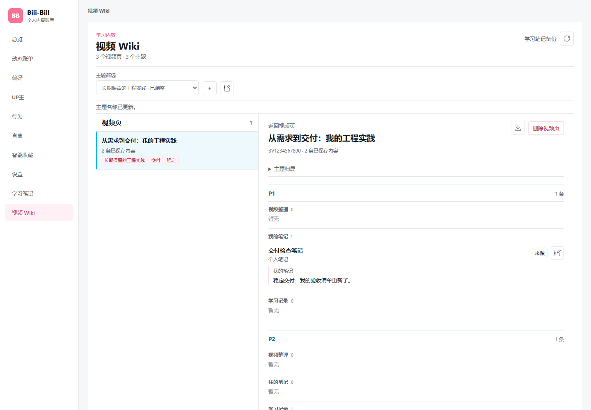
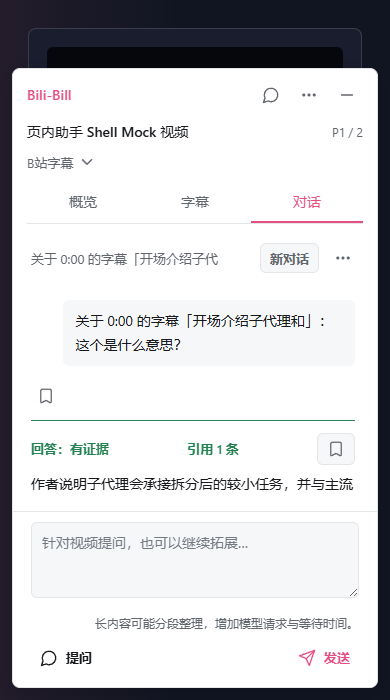
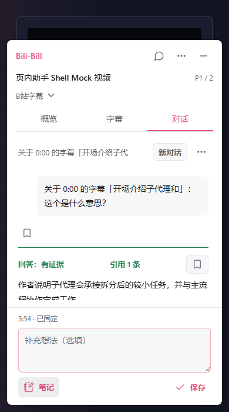

<h1 align="center">Bili-Bill</h1>

<p align="center"><strong>边看边问，随手记下，让 B站视频成为能反复用起来的学习资料。</strong></p>

<p align="center">视频学习助手 · 多轮对话 · 个人笔记 · 视频 Wiki</p>

<p align="center">
  
  
  <a href="LICENSE"></a>
</p>

<p align="center">
  <a href="#开始使用">开始使用</a> ·
  <a href="#边看边学">视频助手</a> ·
  <a href="#让积累再次派上用场">视频 Wiki</a> ·
  <a href="docs/user-guide.md">使用指南</a> ·
  <a href="https://github.com/LittleNuB/BILI-BILL/issues">反馈问题</a>
</p>

<p align="center">
  
</p>

<p align="center"><sub>当前界面的合成数据演示。每条视频一页，笔记保留原视频与分 P；截图不代表真实模型回答质量。</sub></p>

> **版本说明**：本页介绍 `main` 中已实现的 V0.14 功能，仍处于验收阶段。GitHub Releases 最新下载包是旧版 `v0.13.0-alpha`，不包含下述新学习闭环。体验新版请[从源码构建](#开始使用)；[整版验收仍在进行](https://github.com/LittleNuB/BILI-BILL/issues/281)。

## 看过之后，还能留下什么？

教程看懂了一半，想追问一个例子；听到一句有用的话，想留下自己的理解；过一阵子遇到类似问题，又想找回当时的笔记和原句。

Bili-Bill 把这些动作放在同一个学习流程里。**在视频页理解和记录，在视频 Wiki 中找回，再让已有笔记参与下一次对话。** 少一些复制字幕、切换窗口和翻找收藏的往返，多保留一点自己的思考。

| 当你需要 | Bili-Bill 帮你做什么 |
| --- | --- |
| 理解眼前的视频 | 看概览、读字幕、连续追问，也能讨论相关的拓展知识 |
| 留下自己的理解 | 在同一个输入框切换提问与笔记，保存想法、摘录或时间点 |
| 找回过去的积累 | 一个视频一个 Wiki 页面，按分 P 看内容，按主题找相关视频 |
| 把旧笔记用在新问题上 | 授权后检索相关保存内容，在回答旁预览引用的原文 |

## 边看边学

### 视频留在眼前，对话接得下去

浮层按 **概览 → 字幕 → 对话** 排列。首次打开先看紧凑概览；输入问题后进入对话，开始聊天后再次展开会回到原对话。标题栏可以拖动，边缘可以缩放，提问草稿跟着保留。

- **连续追问**：接着问“为什么”“举个例子”“和前面有什么区别”，不用每次重建背景。支持停止、重试和本地会话恢复；逐步显示取决于模型服务是否支持流式返回。
- **视频与拓展分清楚**：可以基于视频学习，也可以讨论一般知识。回答区分视频依据、个人材料与模型拓展；没有可靠字幕时，仍可一般讨论，但不会把标题或模型常识冒充视频结论。
- **原文没有藏起来**：字幕可查看、搜索，导出为 TXT / SRT；可定位的时间引用先预览、再确认跳转，并提供返回入口。
- **可读不等于已核实**：已返回的可读模型正文不会仅因引用校验失败被整段隐藏。未核实或未完成会标注，相应引用、跳转和保存动作仍需符合来源条件。

### 想问就问，想记就记

底部用不同的**提问图标**与**笔记图标**切换用途，两边各自保留草稿。选中字幕后可以带着这句话追问或记笔记；保存笔记不需要先发起 AI 请求，也不会把你带离当前页面。

<p align="center">
  
  
</p>

<p align="center"><sub>共用输入框的两种状态。回复为固定合成测试数据，不是真实学习对话效果。<a href="docs/readme/README.md">截图来源</a></sub></p>

## 让积累再次派上用场

### 一条视频，一页 Wiki

主动保存学习内容后，视频会拥有自己的 Wiki 页面。摘要与要点、我的笔记、摘录和已保存回答按实际内容展示，分 P 保留在页内。**Wiki 与笔记编辑的是同一份内容，不用维护两套副本。** 没有保存的内容就留空，不自动补写文章。

视频积累后，本地算法依据已保存内容把相关视频归到主题下；你可以改主题名称、手动加入或排除视频。**主题负责把相关视频整理到一起，不生成跨视频综述。** 视频页还支持 Markdown 导出。

### 回答能找到你记过的内容

单独开启“学习笔记用于 AI 问答”后，每次提问先在本地寻找相关材料，只把有限节选发给你配置的模型服务。引用出现在对应内容旁，点击 **[1]** 这样的编号，可以预览原文并打开完整条目。

引用会区分个人笔记、原始摘录与已保存模型内容。未找到相关材料时仍可继续讨论，但不会假装引用过知识库。跨视频比较针对你实际保存的材料，不等于读取所有视频全文。

### 只记住你明确确认的目标与偏好

例如“解释时先给一个小例子”。在设置中添加，或把一条自己的聊天消息带入确认表单，再决定是否记住、是否用于后续对话。可以查看、修改、删除或关闭；普通聊天不会自动生成个人画像。

长对话则由单独的上下文预算与早期对话摘要管理，原始会话保留供查回。它不会自动把聊天摘要写进 Wiki 或长期记忆，也不承诺无限长聊。

## 也看清自己的内容消费

学习之外，Bili-Bill 保留了个人内容账单的基础能力：

- **观看账单**：看本周、本月、连续观看时段与设备分布，同时显示实际数据覆盖范围。本机实测播放与 B站历史估算分开，不把历史进度当成准确时长。
- **智能收藏**：同步收藏元数据，用分类、自然语言搜索与引用式问答找回视频；不改动 B站原收藏夹。
- **动态账单**：通过“被淹没的关注、收藏关联更新、关注轮换”帮助兴趣再平衡。入选理由和轮换由本地规则决定，不是“猜你喜欢”或点击率排序；少提醒某位 UP 只影响本地提醒。

## 开始使用

### 体验当前 main

需要 Git、Node.js **24（与本仓库 CI 一致）** 与 npm，以及 Chrome / Edge 桌面浏览器。

```bash
git clone https://github.com/LittleNuB/BILI-BILL.git
cd BILI-BILL
npm ci
npm run build
```

1. 打开 `chrome://extensions` 或 `edge://extensions`，开启开发者模式。
2. 选择“加载已解压的扩展程序”，加载项目里的 **`dist`** 目录。
3. 打开 B站视频页，展开 Bili-Bill。可以先记一条笔记，再到完整面板的“视频 Wiki”查看。
4. 使用 AI 时，在设置中自行配置 OpenAI 兼容模型服务并开启相应授权。知识笔记与目标偏好有各自独立开关。

仅浏览与记录学习内容不需要 AI Key。视频相关生成还需要当前分 P 可用的字幕；[字幕未出现时怎么办](docs/user-guide.md#字幕与回答)。更新源码后需重新构建、重新加载扩展，并刷新视频页。

**旧用户先备份重要内容。** 换一个目录加载可能产生新的扩展身份，不会自动继承旧数据；不要直接卸载唯一的数据副本。详见[更新与备份](docs/user-guide.md#更新与备份)。

<details>
<summary>只想下载现成压缩包？目前提供的是旧版预发布</summary>

前往 [v0.13.0-alpha Release](https://github.com/LittleNuB/BILI-BILL/releases/tag/v0.13.0-alpha)，下载 `bili-bill-0.13.0-alpha.zip` 并解压，加载包含 `manifest.json` 的目录。它不含本页介绍的新版多轮学习、视频 Wiki、笔记引用和显式记忆。

当前源码的包与 Manifest 仍沿用 `0.13.0-alpha` 标识，不能单靠扩展管理页里的版本号判断是否包含新功能。正式 V0.14 发布尚未完成；GitHub 的 Code ZIP 是源码，不是已构建扩展。

</details>

## 数据由你掌握

笔记、Wiki、会话和目标偏好默认保存在当前浏览器本地，**本地优先不等于 AI 完全离线**：

| 操作 | 发往你配置的 AI 服务的内容 |
| --- | --- |
| 看页面、记笔记、浏览或分组 Wiki | 不因此发起模型请求 |
| 主动请求视频相关生成或提问 | 授权范围内的当前问题、所需视频文本与有界会话上下文 |
| 启用学习笔记授权后主动提问 | 按问题匹配到的有限保存内容，不上传整库 |
| 启用目标偏好授权后主动提问 | 本次预算内使用的已勾选目标与偏好 |

智能收藏等 AI 功能使用各自的最小上下文，不继承视频全文授权。关闭授权会阻止后续使用，但无法撤回已发送给外部服务的内容。API Key 保存在本地配置中，不要在共享浏览器中保存不适合共享的凭据。

Bili-Bill 不读取磁盘上的 Cookie、浏览器资料或外部密钥文件，不自动取关，也不向 B站写回收藏或关注关系。[完整说明与容量边界](docs/user-guide.md#数据与能力边界)

## 当前进展与边界

**已合并到 main**：多轮学习与长对话管理、可拖拽缩放浮层、提问/笔记共用输入框、授权知识引用、视频 Wiki 与本地主题、显式目标偏好。

**仍待验收**：真实 B站页面兼容性、不同模型的连续对话与引用效果、原有个人数据升级，以及较大规模与异常生命周期。现有自动测试和合成界面检查不能代替这些结果。[跟踪验收 #281](https://github.com/LittleNuB/BILI-BILL/issues/281)

当前不提供云同步、视频画面理解、OCR、语音转录服务、全库视频全文问答或自动跨视频综述。主题聚合基于本地词项匹配，不是语义知识图谱。首版学习资产上限为 **1000 项 / 10 MiB**；目标偏好不包含在现有备份中。尚未上架浏览器扩展商店。

## 开发与参与

技术栈：**TypeScript · Preact · Vite · IndexedDB / Dexie · Chrome Manifest V3**。

```bash
npm run dev
npm test
npm run typecheck
npm run build
```

- [使用指南](docs/user-guide.md)：安装、授权、字幕、备份与数据口径。
- [产品能力与实现索引](docs/product-overview.md)：当前表述对应的实现、范围和已合并 PR。
- [问题与建议](https://github.com/LittleNuB/BILI-BILL/issues)：欢迎反馈复现步骤和界面问题，请勿附带密钥、Cookie 或完整私人笔记。
- [贡献约定](AGENTS.md)：数据保护、中文文案、工作分支与验证要求。

## License

[MIT](LICENSE)。构建产物附带[第三方许可与归属说明](THIRD_PARTY_NOTICES.txt)。Bili-Bill 是社区开源项目，与哔哩哔哩官方无隶属关系。
