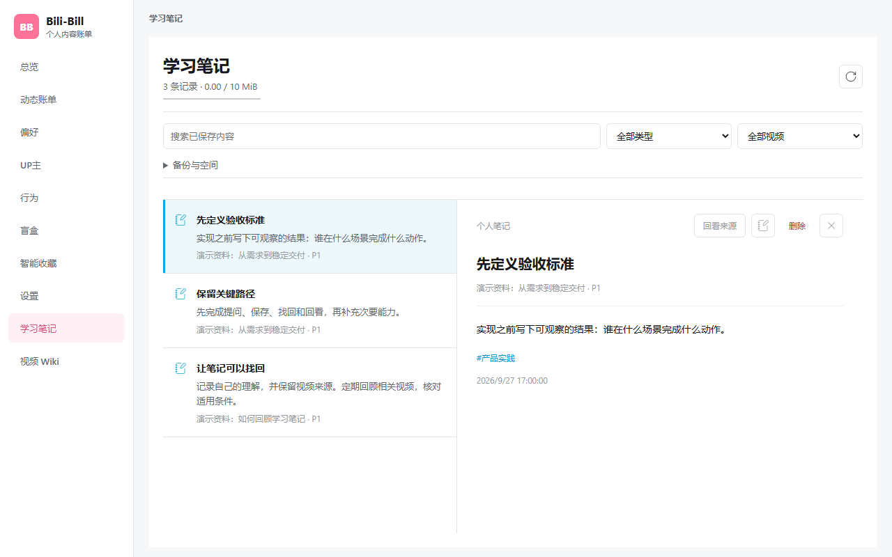
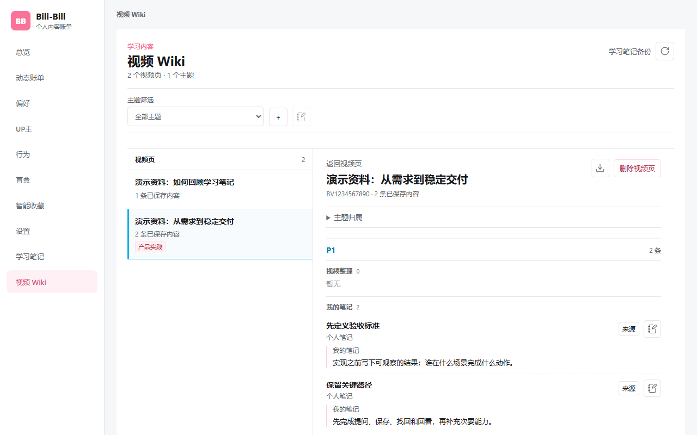
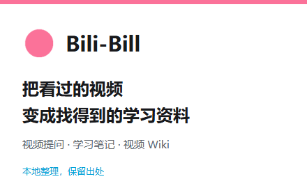

# 送审前候选材料

关联 #308 / #281。不是正式发布，不表示已上传商店。Wiki Agent 后续另议，不进入当前候选范围。

## 已完成

- #309、#310、#312 已合并，统一主线 `f389dbfb7be7789efcfc23a7ee3c71db74df6568`；均未修改产品运行时。
- 全量 Node 测试 808/808；本轮 npm audit 返回 0 vulnerabilities。两个结果不替代真实站点/模型验收。
- Chrome/Edge 的 CDP 生产扩展加载、保存/重启恢复、默认可选权限检查已固化，见 [双浏览器记录](../qa/extension-cdp-311.md)。
- 新增 `scripts/store-candidate-qa.mjs`：真实生产扩展和界面，合成备份导入前预览、预览后重载不提交、重新预览并确认恢复、Wiki 重载及导出内容逐项核对。没有替换应用消息接口或伪造 AI 回复。
- 生成两张 1280×800 界面候选图和一张 440×280 宣传图。界面资料名称明确标注“演示资料”，不使用用户截图或真实观看资料，不声称演示中的虚构视频是线上内容。

## 候选图

这些是本地学习资料能力的可用候选素材，不冒充已通过真实模型验收的助手效果。助手截图应在真实模型流程通过后补充；账单可作为后续补充图，不用伪造观看统计填满页面。

## 本地候选 ZIP

路径：工作区 `release-artifacts/bili-bill-0.13.0-alpha.zip`。这是当前清单版本的送审前格式候选，不是 0.14 正式包，不上传商店。

- 45 个文件，661,741 字节，manifest 位于根目录；许可证随包。
- SHA256：`7438d13b425d1a7d4081a338f002fd1823680f6dce0bc68257421df1e1d178b7`。
- 既有打包器完成敏感路径/内容标记扫描、解包后逐文件哈希与 dist 一致性检查。未读取个人敏感文件；扫描对象仅 dist。
- 正式版本批准后必须重建、重验并重新生成包，不能只改 ZIP 名称。当前未改 manifest、package、release 或 tag。

## 复现素材与恢复检查

设置 `UX014_PLAYWRIGHT_MODULE` 和 `UX014_BROWSER_EXECUTABLE` 的绝对路径后，执行 `node scripts/store-candidate-qa.mjs`。输出到唯一的 `release-artifacts/store-candidate-<时间戳>`，包含报告和 PNG；报告绑定源码提交、dirty 状态、浏览器版本及全部 dist 哈希。测试环境不允许外网，关闭后保留隔离目录，不将其复制到商店包。

开发阶段曾因路由误写为 `#learning` 而找不到导入控件，失败已保留；修正为产品实际路由 `#learning-notes` 后通过。不是产品缺陷，不抹去失败记录。

## 未验收，不得勾选完成

1. 系统权限弹窗的实际允许/拒绝/撤回；默认未授予检查不是这些交互的替代证据。
2. 真实模型请求、回答与引用质量；B 站真实字幕、分 P/SPA、时间跳转/返回。
3. #281 的生产 Worker 有限容量正式时间/内存合同、提交期间进程终止及真实配额耗尽；现有容量/注入故障/预览后重载证据不能替代。
4. 开发者账号、发布主体、私密联系渠道、地区/价格与正式隐私政策。用户已确认账号未注册。
5. 最终版本和送审批准。所有候选材料都需按最终构建复核；未提交任何商店法律声明。
